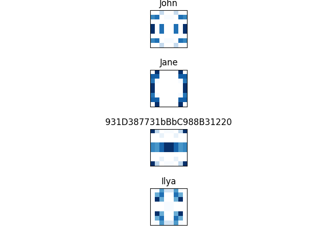

# akkio-identicon



This is [Ilya Krasnovsky's](https://portfolio.ilyak.mywire.org/) submission for the Akkio take-home [challenge](https://akkio.notion.site/Akkio-Take-home-Problem-3d8044df4eea4a5a85edaba31088924a). 

## Objectives and Design

* With this design, legibility of the generated identicons should be feasible at arbitrary scales without too much additional effort. This is because the design uses a well-defined color-placement pattern (with mirroring) that could be numerically scaled in the implementation.  
* Identicons generated for different names (Ex. `"John", "Jane"`) should be different. We have a decently high likelihood of that by basing the color pattern on an MD5 hash of the names.  
* Identicons should be aesthetically pleasing (to a reasonable degree given the time constraints). By mirroring the the color pattern in the top left quadrant of the identicon (which is ultimately the "close-to-unique" identifier of the name) to the other three, we get a simple, symmetric image. 

## Setup

### Prerequisites

* Python 3.11 (lower could work, untested)
* `pipenv`

### Setup

```bash
pipenv install -d
pipenv run python main.py
```